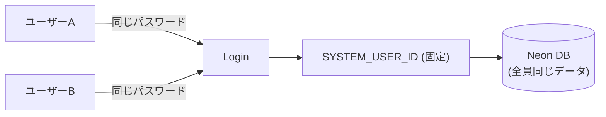
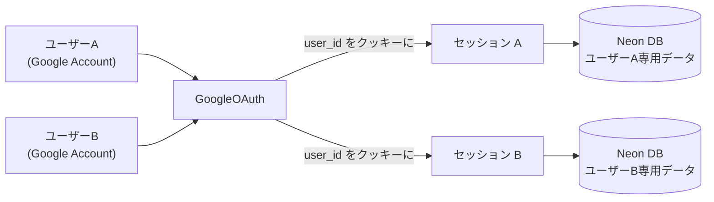

# 他の人も自分専用データで使えるようにするプラン

## 現状の問題



- `SITE_PASSWORD` で通過した全員が同じ `SYSTEM_USER_ID` でDBアクセス → データが混在
- 全テーブルに `userId` は既にある → **スキーマ変更不要**

## 目標の構成



## 変更ファイル一覧

### 1. 認証ヘルパー（新規）
- `lib/auth.ts` — Request からセッション Cookie を読み、現在のユーザー UUID を返す関数

```typescript
// lib/auth.ts (新規)
export async function getCurrentUserId(request: Request): Promise<string | null>
```

### 2. ログイン画面の置き換え
- [`app/login/page.tsx`](app/login/page.tsx) — パスワードフォームを削除し、「Google でログイン」ボタンに変更

### 3. Google OAuth フローの拡張
- [`app/api/auth/google/route.ts`](app/api/auth/google/route.ts) — `scope` に `openid email profile` を追加（ユーザー情報取得のため）
- [`app/api/auth/google/callback/route.ts`](app/api/auth/google/callback/route.ts) — コールバックで Google からユーザー情報を取得し、`users` テーブルに upsert → セッション Cookie に `userId` を JWT として発行

### 4. 認証ガード更新
- [`proxy.ts`](proxy.ts) — `SITE_PASSWORD` チェックをやめ、セッション Cookie から `userId` を検証

### 5. 全 API ルートの `SYSTEM_USER_ID` を除去
- [`app/api/schedules/route.ts`](app/api/schedules/route.ts)
- [`app/api/schedules/[id]/route.ts`](app/api/schedules/[id]/route.ts)
- [`app/api/tasks/route.ts`](app/api/tasks/route.ts)
- [`app/api/tasks/[id]/route.ts`](app/api/tasks/[id]/route.ts)
- 上記すべてで `SYSTEM_USER_ID` → `await getCurrentUserId(request)` に置換

### 6. Vercel デプロイ
1. GitHub に push（または `vercel deploy` コマンド）
2. Vercel ダッシュボードで環境変数を設定（`.env.local` の内容をすべて貼り付け）
3. デプロイ後に確定した URL（例: `https://xxx.vercel.app`）を Google Cloud Console の「承認済みリダイレクト URI」に追加

## セッション Cookie の仕様
- 名前: `user-session`
- 中身: `HMAC-SHA256` で署名した `{ userId, exp }` の JSON を Base64 エンコード（`AUTH_SECRET` で署名）
- 有効期限: 30日 / `httpOnly` / `secure`（本番）

## 作業順序

1. `lib/auth.ts` 作成（他の変更の土台）
2. Google OAuth コールバックを login フローに対応
3. ログイン画面をボタン1個に変更
4. `proxy.ts` を新セッション形式に更新
5. 全 API ルートのユーザー ID 読み取り箇所を置換
6. ローカルでテスト（`npm run dev`）
7. Vercel にデプロイ、リダイレクト URI を更新

## 事前確認が必要なこと
- Google Cloud Console で OAuth クライアントの「承認済みリダイレクト URI」に Vercel URL を追加する権限があるか確認
